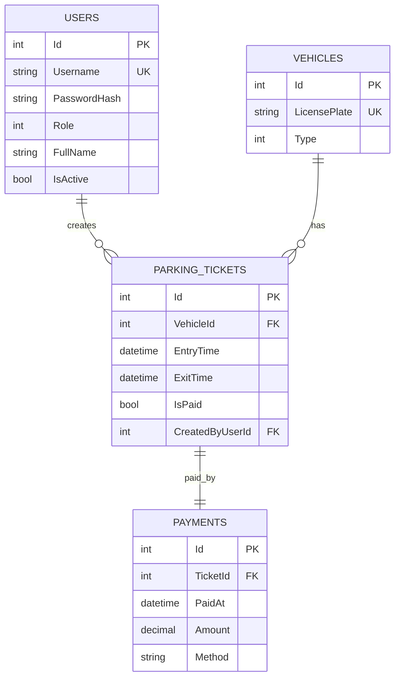
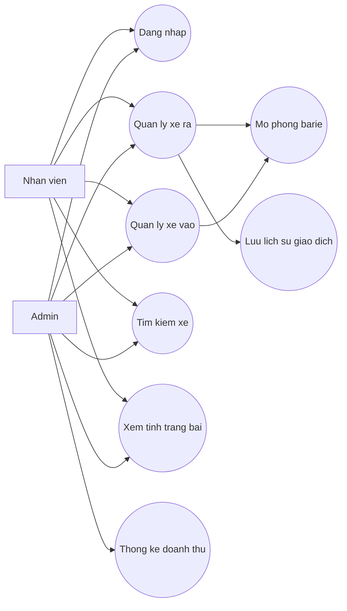
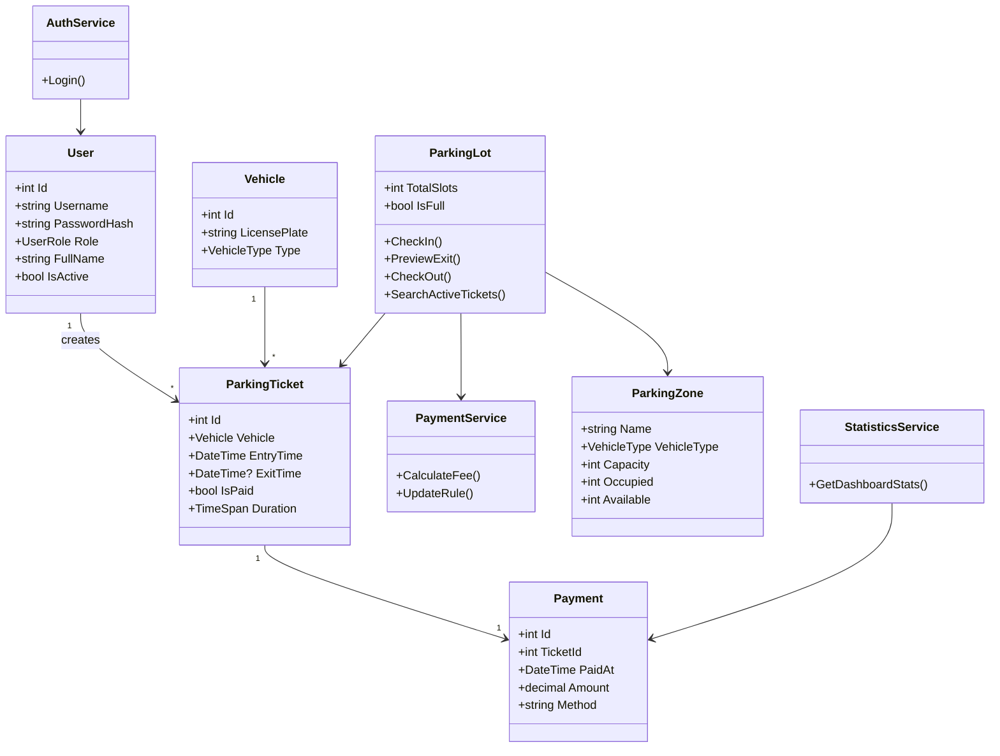

# SmartParkingSystem

Phan mem mo phong bai gui xe thong minh bang C# WinForms va SQLite, thiet ke theo huong OOP, phu hop do an sinh vien.

## Tai khoan mac dinh

| Vai tro | Tai khoan | Mat khau |
|---|---|---|
| Admin | `admin` | `admin123` |
| Nhan vien | `staff` | `staff123` |

## Chuc nang

- Dang nhap he thong theo vai tro Admin/Nhan vien.
- Quan ly xe vao: bien so, loai xe, thoi gian vao.
- Mo phong camera AI tu dong nhan dien xe vao: sinh bien so, loai xe, ghi ve vao bai va mo barie.
- Dieu chinh bang gia gui xe truc tiep tren giao dien.
- Chia bai xe thanh cac khu rieng cho Bicycle, Motorbike va Car.
- Man hinh so do bai xe hien tai, mo bang nut `So do bai xe`.
- Copy bien so xe dang chon sang muc tinh tien xe ra.
- Xoa mot hoac nhieu xe dang gui khi chon tren DataGridView.
- Quan ly xe ra: tim bien so, tinh thoi gian gui va phi gui xe.
- Hien thi tong so cho, so xe hien tai, so cho con trong.
- Danh sach xe dang gui bang `DataGridView`.
- Tim kiem xe theo bien so.
- Canh bao bai day va chan xe vao them.
- Luu lich su giao dich vao SQLite.
- Thong ke doanh thu ngay, tuan, thang.
- Mo phong barie mo/dong bang animation don gian.

## Mo phong nhan dien xe vao

Trong man hinh chinh, khu vuc `Xe vao - nhan dien tu dong` co 3 cach dung:

- `Quet xe vao`: gia lap camera AI nhan dien mot xe moi, tu dong dien bien so, loai xe, thoi gian vao va ghi nhan vao bai.
- `Ghi nhan thu cong`: dung khi muon tu nhap bien so va loai xe.
- `Tu dong quet moi 5 giay`: he thong tu sinh xe vao theo chu ky, phu hop khi thuyet trinh mo phong.

Sau khi nhan dien thanh cong, he thong cap nhat DataGridView, so cho trong, hien thong bao trang thai va mo/dong barie.

## Thao tac tren danh sach xe

- Chon mot dong va bam `Copy bien so` de dua bien so sang o `Xe ra`.
- Co the double-click vao dong xe de dien nhanh bien so sang o `Xe ra`.
- Giu `Ctrl` hoac `Shift` de chon nhieu xe, sau do bam `Xoa xe chon` de xoa khoi danh sach xe dang gui.
- Nut xoa chi xoa xe dang gui, khong tao giao dich thanh toan.

## Dieu chinh gia tien

Khu vuc `Dieu chinh gia tien` cho phep nhap:

- Cot ben trai: gia gio dau.
- Cot ben phai: gia moi gio tiep theo.

Sau khi sua gia, bam `Luu bang gia`. Cac lan tinh phi xe ra sau do se dung bang gia moi.

## Phan vung bai xe

Khu vuc `Phan vung bai xe` chia bai thanh:

- `Khu A - Xe dap`
- `Khu B - Xe may`
- `Khu C - O to`

Moi khu co suc chua rieng. Neu khu cua loai xe da day, he thong se tu choi xe vao du tong bai van con cho o khu khac.

## Man hinh mo phong bai do

Tren thanh tieu de co nut `So do bai xe`. Bam nut nay de mo cua so so do hien tai:

- O mau xanh: da co xe.
- O mau xam: con trong.
- Moi khu hien so xe dang do, suc chua va so cho trong.
- Man hinh tu lam moi moi 3 giay.

## Cau truc thu muc

```text
SmartParkingSystem/
  Data/
    AuthRepository.cs
    DatabaseInitializer.cs
    DbConnectionFactory.cs
    ParkingRepository.cs
  Forms/
    LoginForm.cs
    MainForm.cs
  Models/
    DashboardStats.cs
    ParkingTicket.cs
    Payment.cs
    User.cs
    UserRole.cs
    Vehicle.cs
    VehicleType.cs
  Services/
    AuthService.cs
    ParkingLot.cs
    PasswordHasher.cs
    PaymentService.cs
    StatisticsService.cs
  Docs/
    database.sql
  Program.cs
  SmartParkingSystem.csproj
```

## Huong dan chay

Yeu cau: Windows, .NET SDK 8+ hoac .NET SDK 10 da cai Windows Desktop runtime.

```powershell
cd SmartParkingSystem
dotnet restore --configfile .\NuGet.Config
dotnet run
```

File SQLite se tu dong tao tai:

```text
bin/Debug/net8.0-windows/Data/smart_parking.db
```

## Quy tac tinh phi

| Loai xe | Gio dau | Moi gio tiep theo |
|---|---:|---:|
| Bicycle | 2,000 VND | 1,000 VND |
| Motorbike | 5,000 VND | 3,000 VND |
| Car | 20,000 VND | 10,000 VND |

He thong lam tron len theo gio, toi thieu 1 gio.

## So do co so du lieu



## Use Case



## So do lop


